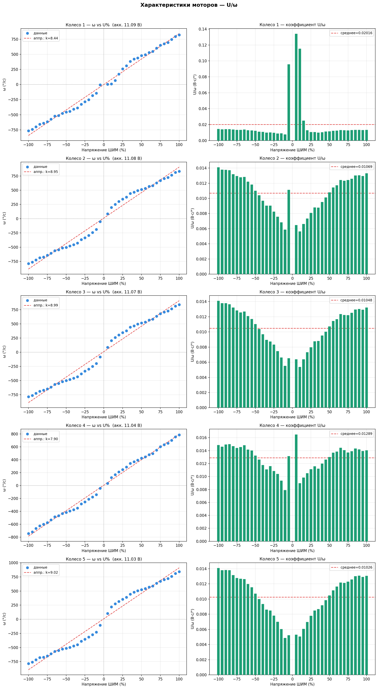

# RK370 Motor Parameters Estimation

Инструменты для сбора и анализа данных об угловой скорости моторов RK370
робота TRIK в зависимости от подаваемого напряжения (ШИМ).

Проект состоит из трёх скриптов:

*   `collect_data.py` собирает сырые данные на роботе.
*   `plot.py` строит графики характеристик по каждому колесу.
*   `plot_omega.py` строит сравнительный график по всем колёсам.

## Содержание

*   [Структура проекта](#структура-проекта)
*   [Нумерация колёс](#нумерация-колёс)
*   [Формат данных](#формат-данных)
*   [Быстрый старт](#быстрый-старт)
*   [Скрипты](#скрипты)
*   [Результаты](#результаты)
*   [Лицензия](#лицензия)

## Структура проекта

```
Exp/
├── collect_data.py       # Сбор данных (запускается на роботе)
├── plot.py                # Графики ω(U%) и U/ω для каждого колеса
├── plot_omega.py           # Совмещённый график ω(U) для всех колёс
├── motor_graphs.png        # Результат: графики по каждому колесу
├── omega_all_wheels.png    # Результат: сравнительный график всех колёс
├── wheels.jpg               # Фото экспериментальной установки
└── motor_data/              # Результаты измерений
    ├── wheel_N_battery.txt  # Напряжение аккумулятора при замере колеса N
    └── wheel_N_v_<V>.txt    # Позиция энкодера (°) и время (мс) при ШИМ V%
```

## Нумерация колёс

Идентификаторы колёс назначаются слева направо, начиная с 1:

**1 → 2 → 3 → 4**

Колесо **5** — мотор без колеса. Он нужен для сравнения характеристик
нагруженного и ненагруженного мотора.

## Формат данных

### `wheel_N_battery.txt`

Содержит напряжение аккумулятора в момент серии экспериментов:

```
battery_voltage_mv: 11.091765403747559
```

### `wheel_N_v_<V>.txt`

Содержит временной ряд положения энкодера. Каждая строка имеет вид
`<угол_в_градусах> <время_в_мс>`; строки, начинающиеся с `#`, — заголовок:

```
# wheel_id: 1
# voltage_percent: 10
# battery_voltage_mv: 11.091765403747559
# format: position_deg time_ms
0 0
1 102
3 305
...
```

## Быстрый старт

### Установите зависимости

```bash
pip install numpy matplotlib
```

### Запустите визуализацию

```bash
cd Exp

# Графики по каждому колесу → motor_graphs.png
python plot.py

# Сравнительный график по всем колёсам → omega_all_wheels.png
python plot_omega.py
```

## Скрипты

### collect_data.py — сбор данных на TRIK

Запускается непосредственно на роботе. Скрипт перебирает значения ШИМ от
−100% до +100% с шагом 5% и для каждого значения выполняет следующие шаги:

1.  Сбрасывает энкодер.
2.  Подаёт напряжение на мотор.
3.  В течение 2 секунд с интервалом 5 мс записывает показания энкодера в файл.
4.  Отключает мотор и делает паузу 1 секунду.

Перед запуском задайте параметры в начале файла:

| Параметр       | Описание                           | Пример |
| -------------- | ----------------------------------- | ------ |
| `WHEEL_ID`     | Номер колеса                        | `1`    |
| `MOTOR_PORT`   | Порт мотора на контроллере          | `"M1"` |
| `ENCODER_PORT` | Порт энкодера на контроллере        | `"E1"` |
| `RUN_TIME`     | Время записи на одно напряжение, с  | `2.0`  |

### plot.py — графики по каждому колесу

Читает все файлы из `motor_data/`, вычисляет угловую скорость ω (°/с) как
наклон линейного участка графика положения (последние ~60% точек по времени)
и для каждого колеса строит:

*   **ω vs ШИМ (%)** — scatter-plot с линейной аппроксимацией.
*   **U/ω vs ШИМ (%)** — гистограмму коэффициента «вольт на градус/с» с
    горизонтальной линией среднего значения.

Результат сохраняется в `motor_graphs.png`.

### plot_omega.py — совмещённый график

Строит зависимость ω от фактического напряжения U (В) для всех колёс на
одном графике. Фактическое напряжение вычисляется по формуле:

```
U = (ШИМ% / 100) × напряжение_аккумулятора
```

Результат сохраняется в `omega_all_wheels.png`.

## Результаты

### Характеристики моторов по каждому колесу



Слева — зависимость угловой скорости от ШИМ с линейной аппроксимацией
(коэффициент `k` в °/с на 1% ШИМ), справа — коэффициент U/ω, который в
идеале должен быть постоянным. У всех колёс заметен характерный провал
коэффициента около нуля — эффект зоны нечувствительности (мёртвой зоны)
мотора при малых напряжениях.

| Колесо         | Наклон k, °/с на 1% ШИМ | Среднее U/ω, В·с/° |
| -------------- | ------------------------ | -------------------- |
| 1               | 8.44                      | 0.02016               |
| 2               | 8.95                      | 0.01069               |
| 3               | 8.99                      | 0.01048               |
| 4               | 7.90                      | 0.01289               |
| 5 (без колеса) | 9.02                      | 0.01026               |

### Сравнение всех колёс


График показывает зависимость угловой скорости от фактического напряжения на
моторе (В) для всех пяти колёс на одних осях. Кривые в целом совпадают, а
S-образный изгиб около нуля подтверждает наличие мёртвой зоны, общей для всех
моторов.

## Лицензия

Проект распространяется по лицензии [MIT](LICENSE).
